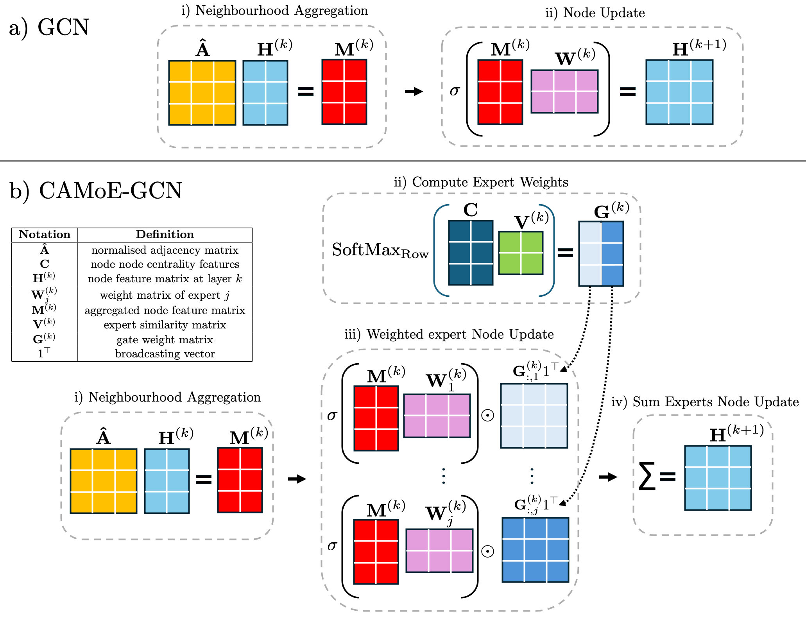

# CAMoE: Centrality-Aware Mixture of Expers for Better Representation Learning in GNNs
This repository contains the implementation of the Centrality-Aware Mixture of Experts (CAMoE) framework, which integrates centrality measures into the Node Update process of Graph Neural Networks (GNNs) to enhance  adaptability and performance. Unlike traditional GNNs that apply uniform updates to all nodes, CAMoE utilizes toplogy-based gating and a Mixture of Experts (MoE) approach to enable adaptive Node Updates informed by node centrality.

CAMoE can be applied to any message passing GNN, and this implementation supports the Graph Convolutional Network (GCN)and the Graph Attention Network (GAT). The figure below illustrates the discrepancies between a standard GCN and a CAMoE-GCN.



**a)** A flowchart illustrating how a graph described by the adjacency matrix $\mathbf{\hat{A}}$ and node feature matrix $\mathbf{H}^{(k)}$ is processed by a standard GCN (as described by [Kipf and Welling, 2016](https://arxiv.org/abs/1609.02907)) to generate $\mathbf{H}^{(k+1)}$. i) Shows the Neighbourhood Aggregation. ii) Displays the Node Update.

**b)** A flowchart showing how the same graph would be processed by the CAMoE-GCN. In addition to $\mathbf{\hat{A}}$ and $\mathbf{H}^{(k)}$, the graph is also described by a node centrality feature matrix $\mathbf{C}$. i) As this is the CAMoE-GCN, it uses the same aggregation method as the standard GCN. ii) The node centrality feature matrix is used to compute weights for each expert layer, with the SoftMax function applied for soft gating. iii) Each node is updated by the experts and then multiplied by the gating weights. iv) The sum of all weighted expert updates results in the new embedding $\mathbf{H}^{(k+1)}$.

# Dependencies
All the dependencies are listed in requirements.txt and can be installed by running the terminal command:
```
pip install -r requirements.txt
```

The python version used is 3.10.12 and the experiments are run on a NVIDIA Tesla T4 GPU with 16GB of RAM.

# Repository content

## The Model
`CAMoE.py` contains the classes `CAMoE_GNN` and `CAMoE_GNN_Layer`, which make up the CAMoE implementation.

## Utils
`utils.py`, `train_utils_graph_classification.py` and `train_utils_node_classification.py` contain helper functions used to split data, train and evaluate the models.

## Data and helper files
The directories `data/`, `expData/` and `organ_data/` contains the preprocessed datasets used in benchmarking the CAMoE-GNNs. These datasets can be loaded using `TUDatasetWithTopFeatures.py`, `PlanetoidWithTopFeatures.py`, `PlanarSATPairsDatasetWithTopFeatures.py` and `organ_data_with_top_features.py`. The first three are adjusted implementations of data loading classes originally from: [TUDataset](https://pytorch-geometric.readthedocs.io/en/latest/_modules/torch_geometric/datasets/tu_dataset.html#TUDataset), [Planetoid](https://pytorch-geometric.readthedocs.io/en/latest/_modules/torch_geometric/datasets/planetoid.html#Planetoid)and [PlanarSATPairsDataset](https://github.com/ralphabb/GNN-RNI/blob/main/PlanarSATPairsDataset.py). They are altered so they support precomputed Node Centrality Features. The organ data is from [MedMNIST](https://medmnist.com/).

Below is an overview of the graph classification datasets used in benchmarking.
| Dataset      | MUTAG                  | PROTEINS               | EXP                    | CEXP                   |
|--------------|------------------------|------------------------|------------------------|------------------------|
| # graphs     | 188                    | 1113                   | 1200                   | 1200                   |
| # classes    | 2                      | 2                      | 2                      | 2                      |
| # features   | 7                      | 3                      | 2                      | 2                      |
| Avg # nodes  | 17.9                   | 39.1                   | 55.8                   | 44.4                   |

Below is an overview of the node classification datasets used in benchmarking.
| Dataset      | ORGAN-S                | ORGAN-C                | CiteSeer               | Cora                   | PubMed                 |
|--------------|------------------------|------------------------|------------------------|------------------------|------------------------|
| # graphs     | 1                      | 1                      | 1                      | 1                      | 1                      |
| # classes    | 11                     | 11                     | 6                      | 7                      | 3                      |
| # features   | 784                    | 784                    | 3703                   | 1433                   | 500                    |
| Avg # nodes  | 25221                  | 23660                  | 3327                   | 2708                   | 19717                  |

# Running the CAMoE
There are two main files for running the CAMoE-GNN.  ```main_graph_classification.py``` is used for training the model on any of the 4 graph classification datasets, and ```main_node_classification.py``` is run for training the model on any of the 5 node classification datasets.


## Running the CAMoE GNN for node classification

To run the script from the terminal, navigate to the directory containing the script and use the following command:

```
python main_node_classification.py 
```

The script can also parse any of the following arguments

- `--dataset` (str): Name of the dataset to use. Default is `'CiteSeer'`.
  - Options include: `'CiteSeer'`, `'Cora'`, `'PubMed'`, `'Organ_C'`, `'Organ_S'`.

- `--lr` (float): Learning rate for the optimizer. Default is `0.005`.

- `--batch_size` (int): Batch size for training. Default is `32`.

- `--gnn_layer` (str): Type of GNN layer to use. Default is `'GCN'`.

- `--max_epochs` (int): Maximum number of training epochs. Default is `1000`.

- `--patience` (int): Number of epochs with no improvement after which training will be stopped early. Default is `100`.

- `--num_folds` (int): Number of folds for cross-validation. Default is `5`.

- `--split_idx` (int): Index of the data split to use. Default is `0`.

- `--hidden_dim` (int): Number of hidden dimensions in the GNN. Default is `32`.

- `--depth` (int): Depth of the GNN (number of layers). Default is `3`.

- `--heads` (int): Number of attention heads (relevant for certain GNN layers like GAT). Default is `1`.

- `--GPU` (bool): Whether to use GPU for training. Default is `True`.

- `--forward_on_top_features` (bool): Whether to forward only on top features. Default is `False`.

- `--gate_on_top_only` (bool): Whether to apply gating only on top features. Default is `True`.

- `--num_experts` (int): Number of experts for the model. Default is `3`.

### Example

The example below would train a 4-layer deep CAMoE-GAT on the CiteSeer dataset with a learning rate of 0.01, a hidden dimensionality of 64 and.

```
python main_node_classification.py --dataset CiteSeer --lr 0.01 --gnn_layer GAT  --hidden_dim 64 --depth 4
```

## Running the CAMoE GNN for graph classification

Similarily to graph classification, run the following command in the terminal.
```
python main_node_classification.py 
```

The script can also parse the same arguments as above with the addition of:

- `--batch_size` (int): Batch size for training. Default is `32`.

The dataset parser is also slightly different, as it supports graph classification datasets.

- `--dataset` (str): Name of the dataset to use. Default is `'MUTAG'`.
  - Options include: `'MUTAG'`, `'PROTENS'`, `'EXP'`, `'CEXP'`.

### Example

The example below would train a 2-layer deep CAMoE-GCN on the PROTEINS dataset with a learning rate of 0.005, a batch size of 32.

```
python main_graph_classification.py --dataset PROTEINS --lr 0.005 --gnn_layer GCN  --batch_size 32 --depth 2
```


# Running the Benchmark models
There are two main files for running the benchmark models, GCN and GAT.  ```benchmark_graph_classification.py``` is used for training the models on any of the 4 graph classification datasets, and ```benchmark_node_classification.py``` is run for training the models on any of the 5 node classification datasets.


## Running the Benchmark GNNs for node classification

To run the scripts from the terminal, navigate to the directory containing the script and use the following command:

```
python benchmark_node_classification.py 
```

The script can also parse any of the following arguments

- `--dataset` (str): Name of the dataset to use. Default is `'CiteSeer'`.
  - Options include: `'CiteSeer'`, `'Cora'`, `'PubMed'`, `'Organ_C'`, `'Organ_S'`.

- `--lr` (float): Learning rate for the optimizer. Default is `0.005`.

- `--batch_size` (int): Batch size for training. Default is `32`.

- `--gnn_model` (str): Type of GNN model to train. Default is `'GCN'`.

- `--max_epochs` (int): Maximum number of training epochs. Default is `1000`.

- `--patience` (int): Number of epochs with no improvement after which training will be stopped early. Default is `100`.

- `--num_folds` (int): Number of folds for cross-validation. Default is `5`.

- `--split_idx` (int): Index of the data split to use. Default is `0`.

- `--hidden_dim` (int): Number of hidden dimensions in the GNN. Default is `32`.

- `--depth` (int): Depth of the GNN (number of layers). Default is `3`.

- `--heads` (int): Number of attention heads (relevant for certain GNN models like GAT). Default is `1`.

- `--GPU` (bool): Whether to use GPU for training. Default is `True`.

- `--forward_on_top_features` (bool): Whether to forward only on top features. Default is `False`.

### Example

The example below would train a 4-layer deep GAT on the CiteSeer dataset with a learning rate of 0.0005, a hidden dimensionality of 64 and and with thwo attention heads per GAT layer.

```
python benchmark_node_classification.py --dataset CiteSeer --lr 0.0005 --gnn_model GAT  --hidden_dim 64 --depth 4 --heads 2
```

## Running the Benchmark GNNs for graph classification

Similarily to graph classification, run the following command in the terminal.
```
python benchmark_graph_classification.py 
```

The script can also parse the same arguments as above with the addition of:

- `--batch_size` (int): Batch size for training. Default is `32`.

The dataset parser is also slightly different, as it supports graph classification datasets.

- `--dataset` (str): Name of the dataset to use. Default is `'MUTAG'`.
  - Options include: `'MUTAG'`, `'PROTENS'`, `'EXP'`, `'CEXP'`.

### Example

The example below would train a 2-layer deep GCN on the PROTEINS dataset with a learning rate of 0.005, a batch size of 32.

```
python main_graph_classification.py --dataset PROTEINS --lr 0.005 --gnn_model GCN  --batch_size 32 --depth 2
```